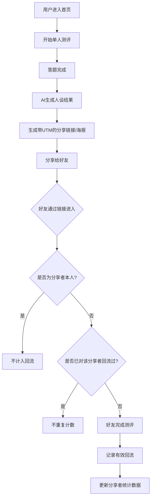
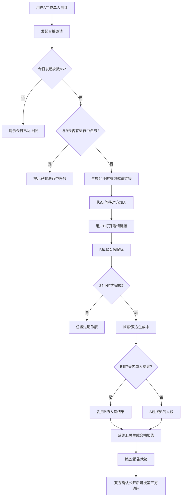

## 1. 产品概述

一款基于 AI 的人设测评社交应用，通过单人测评生成个性化人设，支持分享裂变拉新，以及双人合拍生成关系报告，打造趣味性社交传播链路。

- 核心目标：通过趣味测评 + 社交裂变实现用户增长
- 目标用户：年轻社交用户群体（情侣、闺蜜、室友等）
- 市场价值：通过社交裂变机制实现低成本获客，提升用户粘性与传播性

## 2. 核心功能

### 2.1 用户角色

| 角色 | 注册方式 | 核心权限 |
|------|----------|----------|
| 普通用户 | 昵称+头像自动生成 | 进行单人测评、发起合拍邀请、查看分享数据、生成海报 |

### 2.2 功能模块

1. **首页/测评入口**：开始单人测评入口、我的历史记录入口
2. **单人测评页**：答题流程、AI 人设生成、结果展示、分享裂变
3. **分享裂变系统**：带 UTM 的分享链接、海报二维码生成、回流追踪、分享数据统计
4. **个人中心页**：累计邀请人数、最近回流好友列表、测评历史
5. **合拍邀请页**：发起合拍、生成限时邀请链接、状态展示
6. **合拍结对页**：受邀方填写头像昵称、加入合拍
7. **合拍报告页**：合拍指数、关系类型、共同/冲突标签、双人海报生成

### 2.3 页面详情

| 页面名称 | 模块名称 | 功能描述 |
|----------|----------|----------|
| 首页 | Hero 区域 | 应用介绍、开始测评按钮、我的记录入口 |
| 单人测评页 | 答题模块 | 多轮问题回答、进度条展示 |
| 单人测评页 | AI 结果生成 | 人设称号、标签列表、结果卡片动画 |
| 单人测评页 | 分享模块 | 生成带唯一标识的链接、二维码海报（含品牌角标+测评昵称） |
| 个人中心页 | 分享统计 | 累计邀请人数、最近5位回流好友匿名称号 |
| 合拍邀请页 | 发起合拍 | 从单人结果页发起、生成24小时有效邀请链接 |
| 合拍邀请页 | 状态追踪 | 等待对方、双方生成中、报告就绪、已过期状态展示 |
| 合拍结对页 | 加入合拍 | 填写头像昵称、复用7天内单人结果 |
| 合拍报告页 | 结果展示 | 合拍指数（0-100）、关系类型、共同标签≥3、冲突标签≥3 |
| 合拍报告页 | 双人对比 | 两人人设卡片对比展示 |
| 合拍报告页 | 海报生成 | 一键生成双人合拍海报 |
| 合拍报告页 | 公开授权 | 双方均确认公开后，第三方可通过链接访问 |

## 3. 核心流程

### 3.1 单人测评与分享裂变流程

用户完成单人测评后生成专属分享链接（含分享者ID和测评ID），好友通过链接进入并完成测评后记录一次有效回流。同一好友对同一分享者只计一次，自刷不计入。

### 3.2 双人合拍测评流程

用户A完成单人测评后发起合拍，生成24小时限时邀请链接。用户B通过链接进入并提交头像昵称，双方各自生成或复用AI人设，系统汇总产出合拍报告。

## 4. 用户界面设计

### 4.1 设计风格

- **主色调**：深紫色 #6366F1 作为主色，搭配玫粉色 #EC4899 作为点缀
- **辅助色**：琥珀色 #F59E0B 用于强调按钮和数据高亮
- **背景**：深色渐变背景（深紫到深蓝），营造神秘梦幻氛围
- **按钮风格**：圆角胶囊按钮，带渐变填充和微光效果
- **字体**：标题使用具有设计感的衬线字体，正文使用圆润的无衬线字体
- **布局风格**：卡片式布局，玻璃拟态效果（毛玻璃背景）
- **图标风格**：线性风格，配合柔和的渐变色
- **动效**：卡片浮动动画、渐变流光、数字滚动效果

### 4.2 页面设计概览

| 页面名称 | 模块名称 | UI 元素 |
|----------|----------|----------|
| 首页 | Hero 区域 | 渐变背景、大标题动效、发光CTA按钮、装饰性几何图形 |
| 单人测评页 | 结果卡片 | 玻璃拟态卡片、人设称号大字展示、标签云、渐变色块装饰 |
| 单人测评页 | 分享海报 | 品牌角标、二维码、测评昵称、竖版海报布局 |
| 个人中心页 | 数据统计 | 大数字展示、好友头像列表（匿名称号）、卡片悬浮 |
| 合拍报告页 | 合拍指数 | 环形进度条动画、数字滚动、关系类型徽章 |
| 合拍报告页 | 标签对比 | 左右分栏对比、共同标签高亮、冲突标签交叉标识 |
| 合拍报告页 | 双人海报 | 双人人设卡片并排、合拍指数居中、底部二维码 |

### 4.3 响应式设计

采用移动端优先设计，同时适配桌面端：
- 移动端：单列布局，触控优化（按钮尺寸≥48px）
- 平板/桌面：最大宽度限制，内容居中展示，卡片网格布局
- 海报生成：固定竖版比例，确保分享效果

## 5. 业务规则约束

### 5.1 分享裂变规则
- 每张海报/链接携带唯一分享者ID与测评ID
- 同一好友对同一分享者只计一次有效回流
- 分享者本人点击自己的链接不计入（自刷防作弊）
- 二维码包含品牌角标与测评昵称

### 5.2 合拍规则
- 同一对用户同时进行中的合拍任务只能有一个
- 发起方（A）每天最多发起5次合拍邀请
- 邀请链接有效期24小时，超时任务作废
- 受邀方（B）7天内的单人测评结果可复用
- 合拍报告需双方均确认公开后，第三方才可访问
