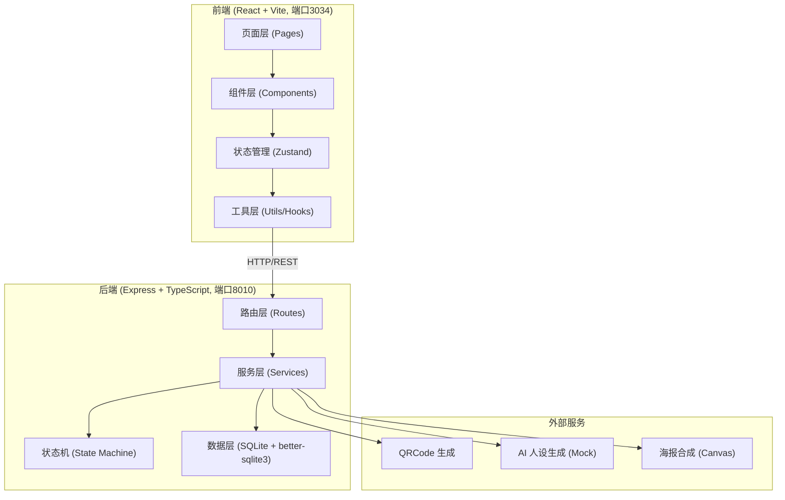
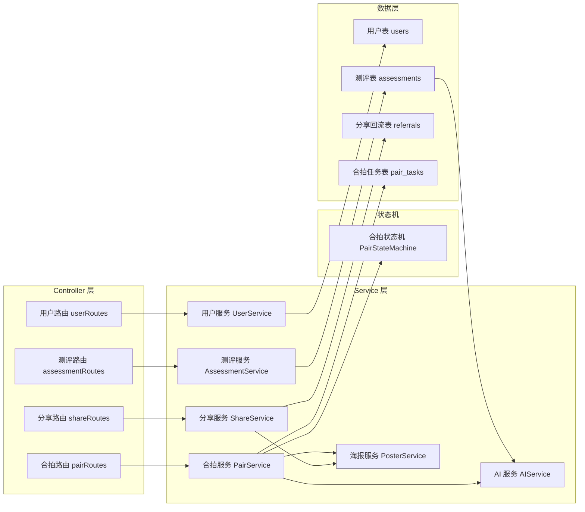
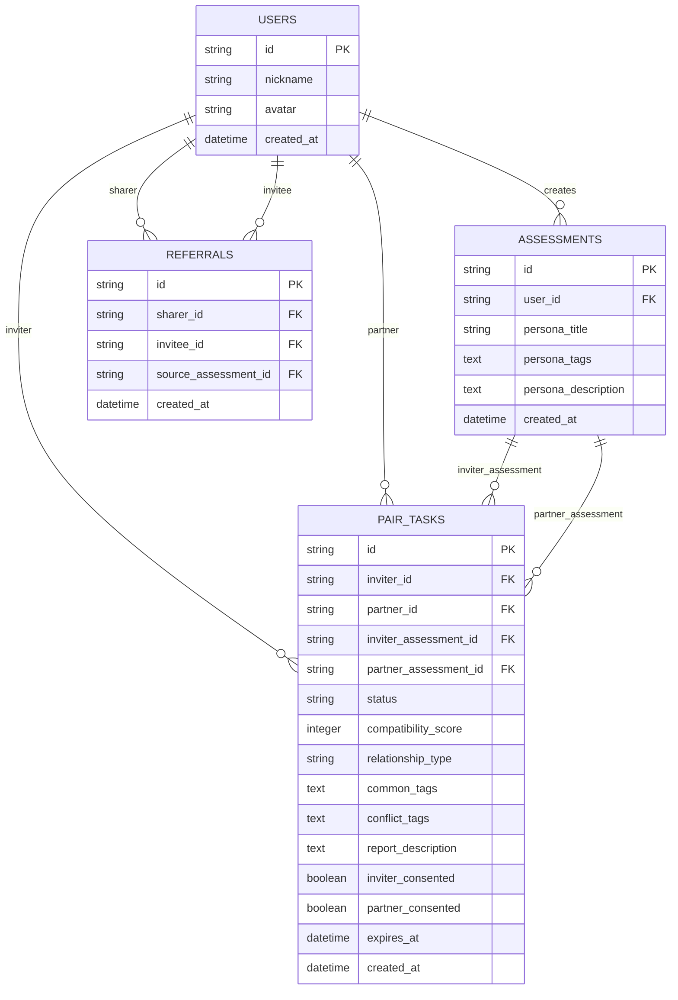

## 1. 架构设计



## 2. 技术描述

- **前端**：React@18 + TypeScript + Vite@5 + TailwindCSS@3 + Zustand@4 + React Router@6 + Lucide React
- **初始化工具**：vite-init (react-express-ts 模板)
- **后端**：Express@4 + TypeScript + better-sqlite3
- **数据库**：SQLite（嵌入式，无需额外部署，开发便捷）
- **二维码**：qrcode 库
- **海报合成**：前端 html2canvas 或后端 Canvas API
- **CORS**：cors 中间件处理跨域

## 3. 路由定义

| 路由 | 用途 |
|------|------|
| / | 首页 - 测评入口 |
| /quiz | 单人测评答题页 |
| /result/:id | 单人测评结果页 + 分享 |
| /profile | 个人中心 - 分享数据统计 |
| /pair/invite/:taskId | 合拍邀请状态页（发起方视角） |
| /pair/join/:taskId | 合拍结对页（受邀方视角） |
| /pair/result/:taskId | 合拍报告页 |
| /share/:sharerId/:assessmentId | 分享落地页（带UTM参数） |

## 4. API 定义

### 4.1 用户相关

```typescript
// 创建/获取用户
POST /api/users
Request: { nickname: string; avatar?: string }
Response: { id: string; nickname: string; avatar: string; createdAt: string }

// 获取用户分享统计
GET /api/users/:userId/share-stats
Response: {
  totalInvites: number;
  recentFriends: Array<{ id: string; anonymousTitle: string }>;
}
```

### 4.2 单人测评相关

```typescript
// 创建测评
POST /api/assessments
Request: { userId: string; answers: Array<{ questionId: number; answer: string }> }
Response: {
  id: string;
  userId: string;
  persona: {
    title: string;
    tags: string[];
    description: string;
  };
  createdAt: string;
}

// 获取测评结果
GET /api/assessments/:id
Response: AssessmentResult

// 生成分享链接和二维码
POST /api/share/generate
Request: { userId: string; assessmentId: string }
Response: {
  shareUrl: string;  // 如: /share/{userId}/{assessmentId}?utm_source=poster
  qrCodeDataUrl: string;
  posterUrl: string;
}
```

### 4.3 分享回流追踪

```typescript
// 记录回流点击（不立即计数，需完成测评后才计有效）
POST /api/share/track-click
Request: { sharerId: string; assessmentId: string; visitorId: string }
Response: { tracked: boolean }

// 记录有效回流（好友完成测评后调用）
POST /api/share/record-referral
Request: { sharerId: string; assessmentId: string; newUserId: string }
Response: { counted: boolean; reason?: string }
```

### 4.4 合拍相关

```typescript
// 发起合拍邀请
POST /api/pair/invite
Request: { inviterId: string; inviterAssessmentId: string }
Response: {
  taskId: string;
  inviteUrl: string;
  status: 'WAITING_PARTNER';
  expiresAt: string;
}

// 获取合拍任务状态
GET /api/pair/tasks/:taskId
Request Query: { userId: string }
Response: PairTaskDetail

// 受邀方加入合拍
POST /api/pair/join
Request: { taskId: string; nickname: string; avatar?: string }
Response: {
  taskId: string;
  status: 'GENERATING';
  partnerId: string;
}

// 确认公开合拍报告
POST /api/pair/tasks/:taskId/consent
Request: { userId: string }
Response: { taskId: string; bothConsented: boolean }

// 获取今日发起次数
GET /api/pair/daily-count/:userId
Response: { count: number; maxCount: number }
```

### 4.5 类型定义

```typescript
type PairStatus = 
  | 'WAITING_PARTNER'   // 等待对方加入
  | 'GENERATING'        // 双方结果生成中
  | 'READY'             // 报告就绪
  | 'EXPIRED';          // 已过期

interface PairTaskDetail {
  id: string;
  status: PairStatus;
  inviter: { id: string; nickname: string; avatar: string };
  partner?: { id: string; nickname: string; avatar: string };
  inviterAssessment?: PersonaResult;
  partnerAssessment?: PersonaResult;
  compatibilityReport?: CompatibilityReport;
  expiresAt: string;
  createdAt: string;
  inviterConsented: boolean;
  partnerConsented: boolean;
}

interface PersonaResult {
  id: string;
  title: string;
  tags: string[];
  description: string;
}

interface CompatibilityReport {
  score: number;              // 0-100
  relationshipType: string;   // 如：最佳拍档、相爱相杀、互补搭子
  commonTags: string[];       // ≥3
  conflictTags: string[];     // ≥3
  description: string;
}
```

## 5. 服务端架构图



## 6. 数据模型

### 6.1 ER 图



### 6.2 DDL 语句

```sql
-- 用户表
CREATE TABLE IF NOT EXISTS users (
  id TEXT PRIMARY KEY,
  nickname TEXT NOT NULL,
  avatar TEXT,
  created_at DATETIME DEFAULT CURRENT_TIMESTAMP
);

-- 测评结果表
CREATE TABLE IF NOT EXISTS assessments (
  id TEXT PRIMARY KEY,
  user_id TEXT NOT NULL REFERENCES users(id),
  persona_title TEXT NOT NULL,
  persona_tags TEXT NOT NULL,
  persona_description TEXT NOT NULL,
  created_at DATETIME DEFAULT CURRENT_TIMESTAMP
);
CREATE INDEX IF NOT EXISTS idx_assessments_user_id ON assessments(user_id);
CREATE INDEX IF NOT EXISTS idx_assessments_created_at ON assessments(created_at);

-- 分享回流表（保证同一分享者+同一受邀方唯一）
CREATE TABLE IF NOT EXISTS referrals (
  id TEXT PRIMARY KEY,
  sharer_id TEXT NOT NULL REFERENCES users(id),
  invitee_id TEXT NOT NULL REFERENCES users(id),
  source_assessment_id TEXT REFERENCES assessments(id),
  created_at DATETIME DEFAULT CURRENT_TIMESTAMP,
  UNIQUE(sharer_id, invitee_id)
);
CREATE INDEX IF NOT EXISTS idx_referrals_sharer_id ON referrals(sharer_id);

-- 合拍任务表
CREATE TABLE IF NOT EXISTS pair_tasks (
  id TEXT PRIMARY KEY,
  inviter_id TEXT NOT NULL REFERENCES users(id),
  partner_id TEXT REFERENCES users(id),
  inviter_assessment_id TEXT NOT NULL REFERENCES assessments(id),
  partner_assessment_id TEXT REFERENCES assessments(id),
  status TEXT NOT NULL DEFAULT 'WAITING_PARTNER',
  compatibility_score INTEGER,
  relationship_type TEXT,
  common_tags TEXT,
  conflict_tags TEXT,
  report_description TEXT,
  inviter_consented INTEGER DEFAULT 0,
  partner_consented INTEGER DEFAULT 0,
  expires_at DATETIME NOT NULL,
  created_at DATETIME DEFAULT CURRENT_TIMESTAMP
);
CREATE INDEX IF NOT EXISTS idx_pair_tasks_inviter ON pair_tasks(inviter_id);
CREATE INDEX IF NOT EXISTS idx_pair_tasks_partner ON pair_tasks(partner_id);
CREATE INDEX IF NOT EXISTS idx_pair_tasks_status ON pair_tasks(status);
CREATE INDEX IF NOT EXISTS idx_pair_tasks_expires ON pair_tasks(expires_at);
```
